# HOWTO

Below are some instructions to help you build a custom firmware for your keyboard. I used a Windows system
to build it, but the steps should be pretty similar for other platforms.

If you can read Japanese, check out this blog post by git user mobitan, as it is much more detailed than this
little HOWTO.
http://d.hatena.ne.jp/mobitan/searchdiary?word=%2A%5B%A5%AD%A1%BC%A5%DC%A1%BC%A5%C9%5D

Basic instructions can also be found on the official website: https://www.esrille.com/keyboard/support.html

## Preparations

In order to build the firmware, you need the source code as well as the MPLAP X IDE, the XC8 compiler and the MLA
from Microchip. If you are on Linux, your distribution might provide packages for the Microchip applications.
However, keep in mind that you may run into problems if you use different versions than the ones used for the
original build (see below).

### Download source code

You can get it from https://github.com/esrille/new-keyboard. Either use git clone or download the zip file.

### Install MPLAB X IDE

You can get it from https://www.microchip.com/pagehandler/en-us/family/mplabx/home.html. You should probably be fine
with the latest version. I used v3.20 for my builds and had no problems. It came bundled with a Integrated
Programming Environment (IPE), which you do not need to install to build this firmware.

### Install MPLAB XC8 Compiler

You can get it from https://www.microchip.com/pagehandler/en-us/devtools/mplabxc/home.html. I recommend to download
the version the original firmware was built with (currently v1.34). Other versions might not work as expected.

### Install Microchip Libraries for Applications (MLA)

You can get it from https://www.microchip.com/pagehandler/en-us/devtools/mla/home.html. You should probably be fine
with the latest version, however, I chose the same version as in the original project (currently v2013-12-20).

## Build firmware

### Open project

Start the MPLAB X IDE and open the MPLAB.X project within the source code.

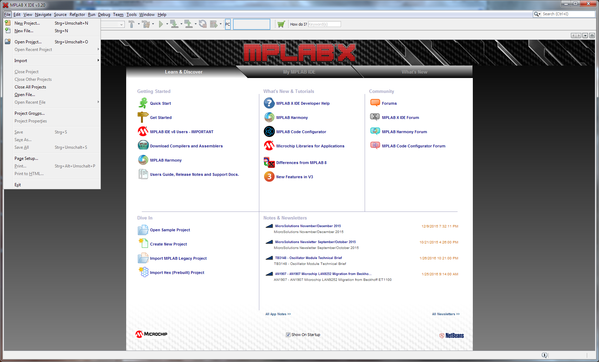
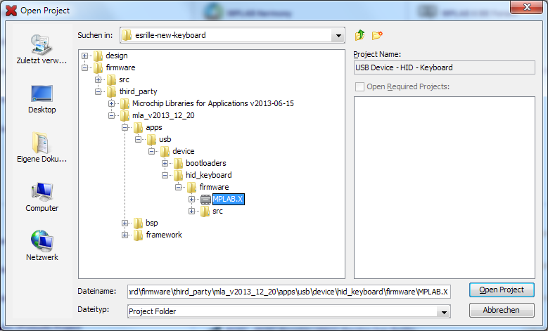

Make sure you open the project located within the folder `mla_v2013_12_20`.

### Choose configuration

You can set the configuration by right-clicking onto the project. If your keyboard has the pointing device built in,
you have to make sure the configuration is set to `Esrille_New_Keyboard_with_Mouse`, otherwise your pointing device
will not work anymore once you upload the new firmware.

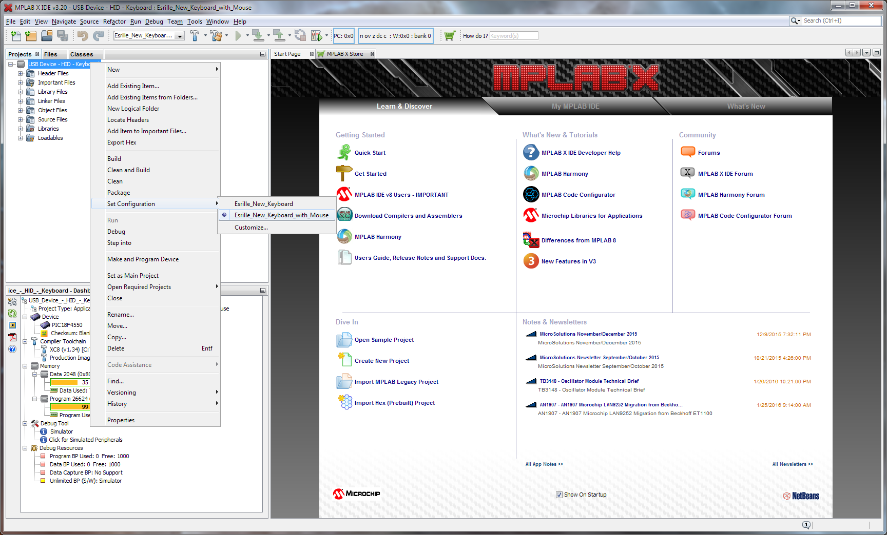

### Modify the source code

The most interesting files are `KeyboardCommon.c`, `KeyboardJP.c` and `KeyboardUS.c`.

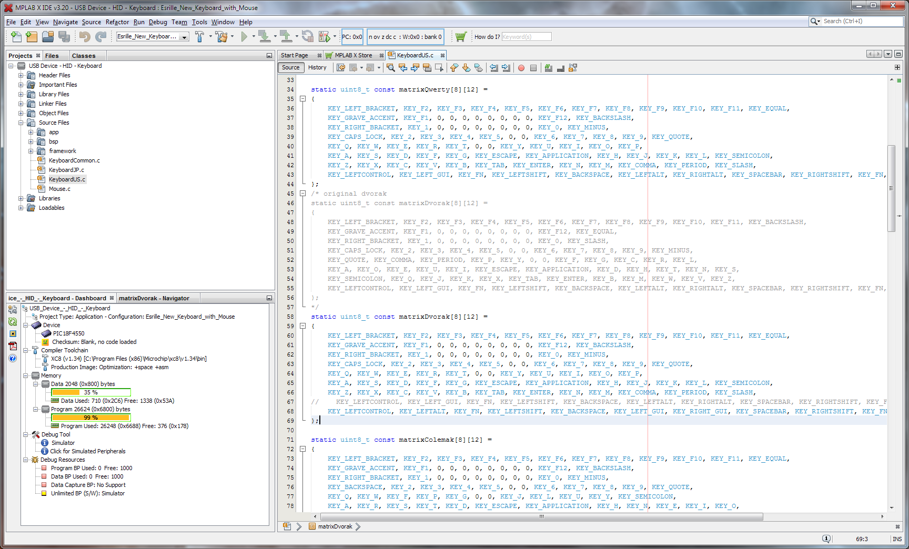

The code is structured quite well (imho) and it should not be too hard to change the firmware to your liking, even
if your C skills are not your strongest asset. The matrix however, which the keys are arranged in, is not intuitive
(see any of the matrix arrays). I got by by just comparing the keys and switching them accordingly, but if you want
a better understanding how the keys are arranged, you can check out the links I mentioned at the beginning of this
HOWTO. The official support page contains a table with the matrix layout where you can see the position of each key
within the matrix. A nice picture of the layout can be found on the Japanese blog mentioned (last time I checked).

### Build the firmware

When you are done modifying the source code, build the project.

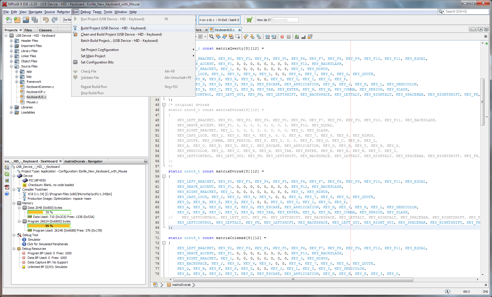

Wait until you see the `BUILD SUCCESSFUL` message followed by `Loading complete` in the lower right half.

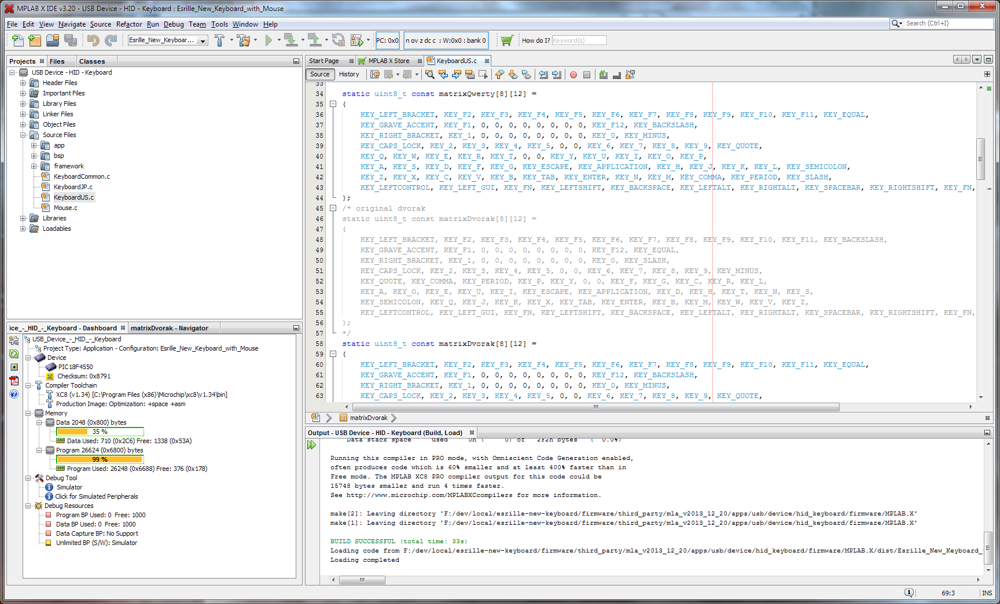

## Upload the firmware

### Start the bootloader

The bootloader comes with the MLA package installed earlier. Depending on the application version its location may
differ.

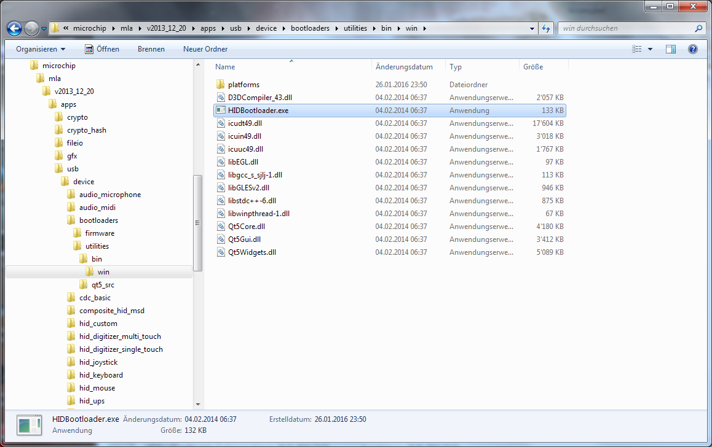

### Prepare keyboard

When you start the bootloader, it will not find any devices.

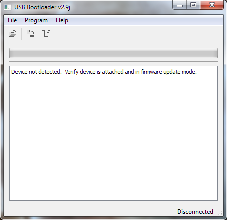

To be able to upload your new firmware to the keyboard, unplug the keyboard and, while holding down the Escape key,
plug it back in. The leftmost LED will start blinking red if done correctly and the bootloader will detect your
keyboard.

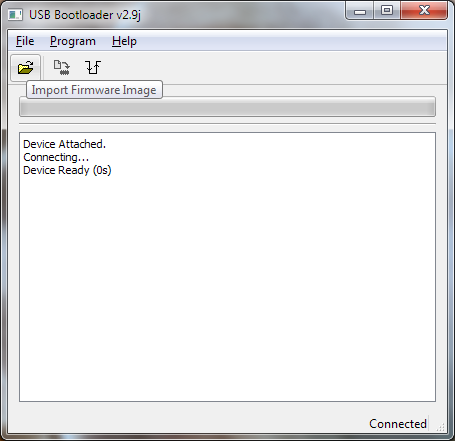

### Upload new firmare

Open the hex file we build earlier.

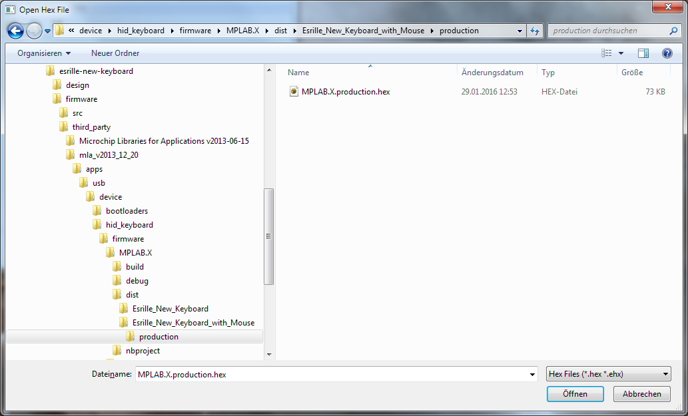

Upload the firmware.

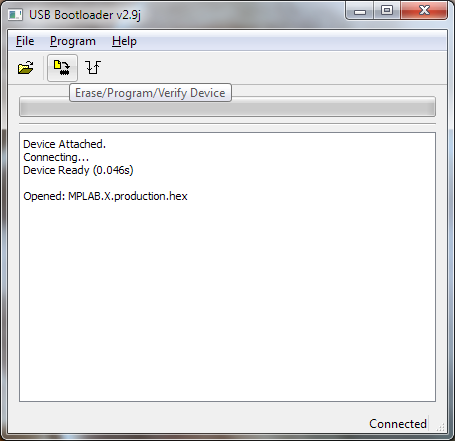

Reset and replug your keyboard.

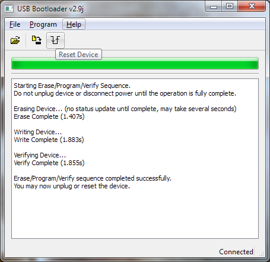

Your keyboard should now be running with the new firmware.
